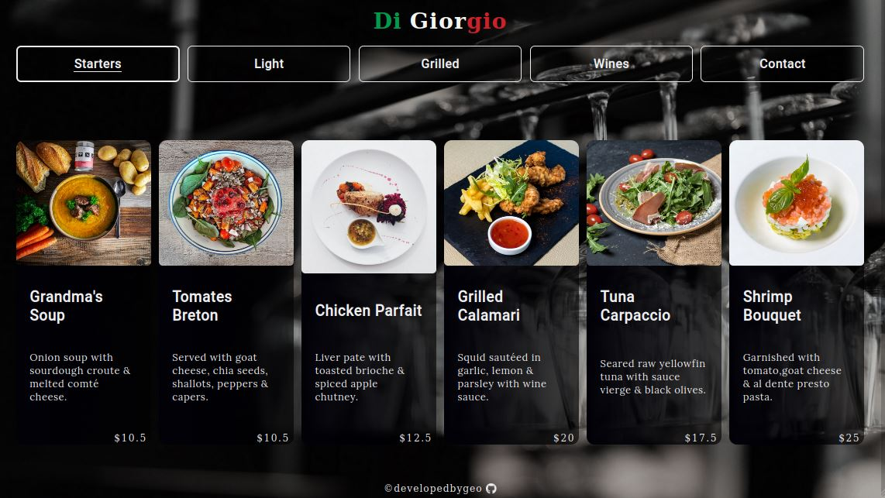

# Restaurant Page



Welcome to Di Giorgio, a restaurant page whose content is created dynamically through JavaScript. It was built as part of The Odin Project's curriculum, with a mobile-first approach. The goal of this project was to use ES6 modules and Webpack, to bundle everything together.

## Installation

After cloning, it would be essential to install the dependencies:

```bash
npm install
```

Creating the /dist directory would require building.

```bash
npm run build
```

`watch` has also been configured and you can run it as:

```bash
npm run watch
```

## Features

- 5 dynamically-created sections
- Mobile responsive

Note: The `Contact` section is dynamically rendered depending on the screen's width. Therefore, when testing the responsiveness through the Dev Tools, it is essential to click on it again to re-render, based on the viewport.

## Tech

- JavaScript
- Webpack
- NPM
- FontAwesome

For a more detailed overview of the dependencies, please check `package.json`.

## Contributing

Contributions are certainly welcome. Please feel free to open an issue/PR if there is something you would like to be changed.

## Acknowledgements

A massive thank you to The Odin Project & freeCodeCamp community, as their guidance and learning process have been invaluable.

## Live Version

https://developedbygeo.github.io/Restaurant

## License

[MIT](https://choosealicense.com/licenses/mit/)
